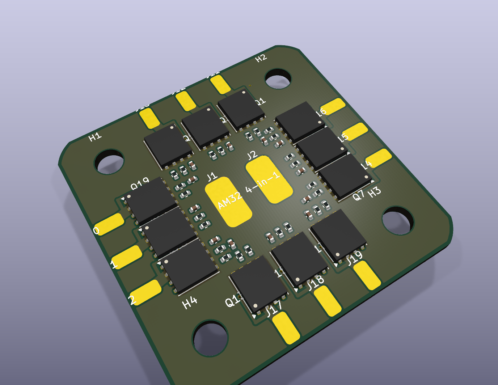

# kicad-flow

An MCP server for authoring KiCad 10 schematics and printed circuit boards.
It exposes small, composable operations—place a part, inspect its pins, draw a
wire, assign a net, add copper—and reports the geometry or connectivity KiCad
actually produced.

The boundary is intentional: the caller chooses the circuit, placement and
routing; KiCadFlow handles file-format mechanics, readback and validation. It
does not contain an autoplacer, autorouter or inferred design policy.

## Examples

The scripts in [`examples/scripts/`](examples/scripts/) are executable
integration checks. KiCad schematic and PCB mutations pass through
`Client(mcp)`; the scripts also manage their own output folders and test
fixtures. Their printed summaries are the source of truth for current results,
while checked-in images are selected previews rather than a complete run log.

| | |
| --- | --- |
| **[fc](examples/fc/)** — Multi-sheet STM32 flight-controller schematic exercise. It reports ERC and visual-layout findings separately.<br><br>[](examples/fc/) | **[led_digits](examples/led_digits/)** — Full schematic/PCB and API-coverage fixture with completed routing.<br><br>[](examples/led_digits/) |
| **[art_board](examples/art_board/)** — Line-and-arc outline, cutouts and editable front/back silkscreen primitives.<br><br>[](examples/art_board/) | **[batman](examples/batman/)** — Shaped LED schematic and PCB with copper pours and reverse-side artwork.<br><br>[](examples/batman/) |
| **[esc4in1](examples/esc4in1/)** — AM32 four-channel hierarchy and dense two-sided placement exercise. The schematic is clean; the PCB remains an intentionally reported work in progress, not a fabrication reference.<br><br>[](examples/esc4in1/) | |

Run an example from the repository root, for example:

```powershell
.\.venv\Scripts\python.exe examples\scripts\led_digits.py
```

> **Platform status:** the current PCB backend is developed and exercised on
> Windows with KiCad 10. It uses both `kicad-cli` and KiCad's bundled Python
> runtime. Other platforms are not yet claimed as supported.

All public coordinates and dimensions are millimetres. Schematic sheets default
to A4; prefer another functional A4 sheet over enlarging a crowded page to A3.

## Quick start

Requirements:

- Python 3.10 or newer
- KiCad 10, with `kicad-cli` on `PATH` or in its default Windows installation

From PowerShell:

```powershell
python -m venv .venv
.\.venv\Scripts\python.exe -m pip install -e .
.\.venv\Scripts\python.exe -m kicad_flow.server doctor
```

`doctor` is read-only. Run it first to verify KiCad, rendering, dashboard assets
and optional provider data.

## Run the server

| Mode | Command | Connect from the MCP client |
| --- | --- | --- |
| stdio | `.\.venv\Scripts\python.exe -m kicad_flow.server` | Configure the client to spawn this command. |
| HTTP | `.\.venv\Scripts\python.exe -m kicad_flow.server --http` | `http://127.0.0.1:8471/mcp` |

HTTP bind address and port are explicit options; use `--help` for the current
defaults. Stdio is the normal choice for desktop MCP clients. HTTP is useful
when one long-running local server should serve multiple sessions.

The live dashboard starts alongside either mode and is available at
`http://127.0.0.1:8472` by default. It follows the active schematic or board,
offers board 2D/3D views, and streams individual tool activity. Set
`KICAD_FLOW_MONITOR=0` to disable it or set the variable to another port number
to move it. Dashboard startup is best-effort and never determines whether the
MCP server can run.

## What the server covers

Schematic operations include symbols and multi-units, wires, junctions, labels,
power symbols, hierarchical sheets, fields, connectivity readback, ERC, visual
layout findings and rendered previews.

Board operations include footprints on either face, exact pad and courtyard
geometry, placement measurements, stackups, net classes, numeric design rules,
tracks, layer-span vias, configurable zones, board outlines, silkscreen
graphics, manufacturing limits, connected-group and route-metric readback,
regional geometry inspection, DRC, 2D plots and native KiCad 3D renders.

Placement is composed before it is applied. The MCP instructions require the
caller to inventory exact symbol or footprint geometry, divide the page or board
into functional regions, reserve wiring, routing, power and thermal space, and
prepare explicit coordinates before placement. Validation reports facts; it
does not guess, score, spread or repair a design.

For schematics, `measure_schematic_placement` checks that explicit component
list without changing the sheet, including transformed pins, visible bounds,
overlaps and page limits. Schematic list writes are schema-strict and atomic: a
bad element identifies its index and leaves none of that list applied.

`inspect_schematic_scene` provides spatial context without images: stable object
IDs, bounds, transformed pins, wires, fields and conservative overlap findings.
Query one sheet or an explicit rectangle, then pass its revision as `since` to
receive changes only. The monitor's **Geometry** view displays those same objects
as vectors. See [scene queries and revision handling](docs/schematic-scenes.md)
for limits, estimated text bounds and the distinction from electrical validation.

For boards, `check_board` can dry-run caller-supplied tracks, vias and zones on
an isolated copy and report newly introduced and resolved DRC findings. Findings
are attributed to candidate list indexes when KiCad identifies the candidate
object. PCB list writes are atomic, and destructive copper removal requires an
explicit UUID/filter or `all=true`. The caller still chooses every coordinate;
the preflight prevents connectivity progress from hiding shorts, crossings or
clearance regressions.

An operation returning `ok: true` means the operation executed. Inspection
results have their own outcome fields such as `clean`, `complete` and `valid`.
A successful call is not evidence that ERC, DRC, routing or placement is clean.

## Providers and project assets

The provider layer is optional and isolated from the schematic and PCB
contracts. The checked-in JLCPCB profile is a dated rigid-FR4 capability
snapshot, not a live quotation service. Query its supported choices through the
MCP instead of copying values from this README.

`search_parts` can query a local, Git-ignored JLCPCB/LCSC SQLite catalogue.
Stock and pricing reflect the downloaded snapshot and must be reconfirmed before
ordering. Installation and provenance are documented in
[the JLCPCB provider README](src/kicad_flow/providers/jlcpcb/README.md).

Downloaded symbol, footprint and 3D-model bundles can be imported into a
project-local library. KiCadFlow does not modify KiCad's global libraries.

The MCP instructions also define a project-local `docs/` structure for design
intent, decisions, research provenance, datasheets and missing information.
The MCP does not author those documents. See
[project documentation guidance](docs/project-documentation.md).

## Windows release

Build the self-contained application directory in an isolated release virtual
environment:

```powershell
powershell -ExecutionPolicy Bypass -File packaging\windows\build.ps1
```

The result is `dist\kicad-flow\kicad-flow.exe`. Distribute the entire
`dist\kicad-flow` directory, not the executable alone. KiCad 10 remains a system
prerequisite, and the optional parts catalogue remains external.

The release build verifies version reporting, read-only diagnostics, exact tool
registration parity with the source server, and a schematic write over the real
stdio MCP transport.

```powershell
dist\kicad-flow\kicad-flow.exe --version
dist\kicad-flow\kicad-flow.exe doctor
dist\kicad-flow\kicad-flow.exe doctor --json
```

## Claude Desktop example

Use stdio and point `command` at the virtual-environment interpreter:

```json
{
  "mcpServers": {
    "kicad-flow": {
      "command": "C:\\path\\to\\kicad-flow\\.venv\\Scripts\\python.exe",
      "args": ["-m", "kicad_flow.server"]
    }
  }
}
```

Restart Claude Desktop after changing its configuration.

## Development

```powershell
python -m ruff check .
python -m mypy
python examples\scripts\fc.py
python examples\scripts\led_digits.py
```

There is no separate unit suite. The examples exercise the same MCP tool layer
used by clients; lint, strict typing and the relevant examples must pass before
a change lands.
