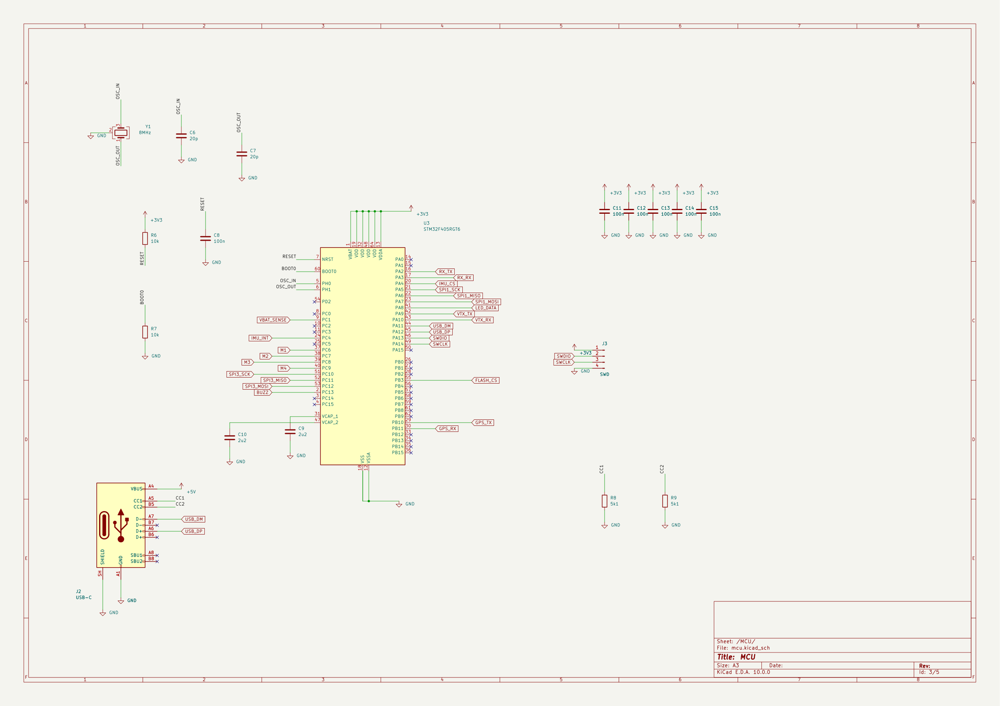
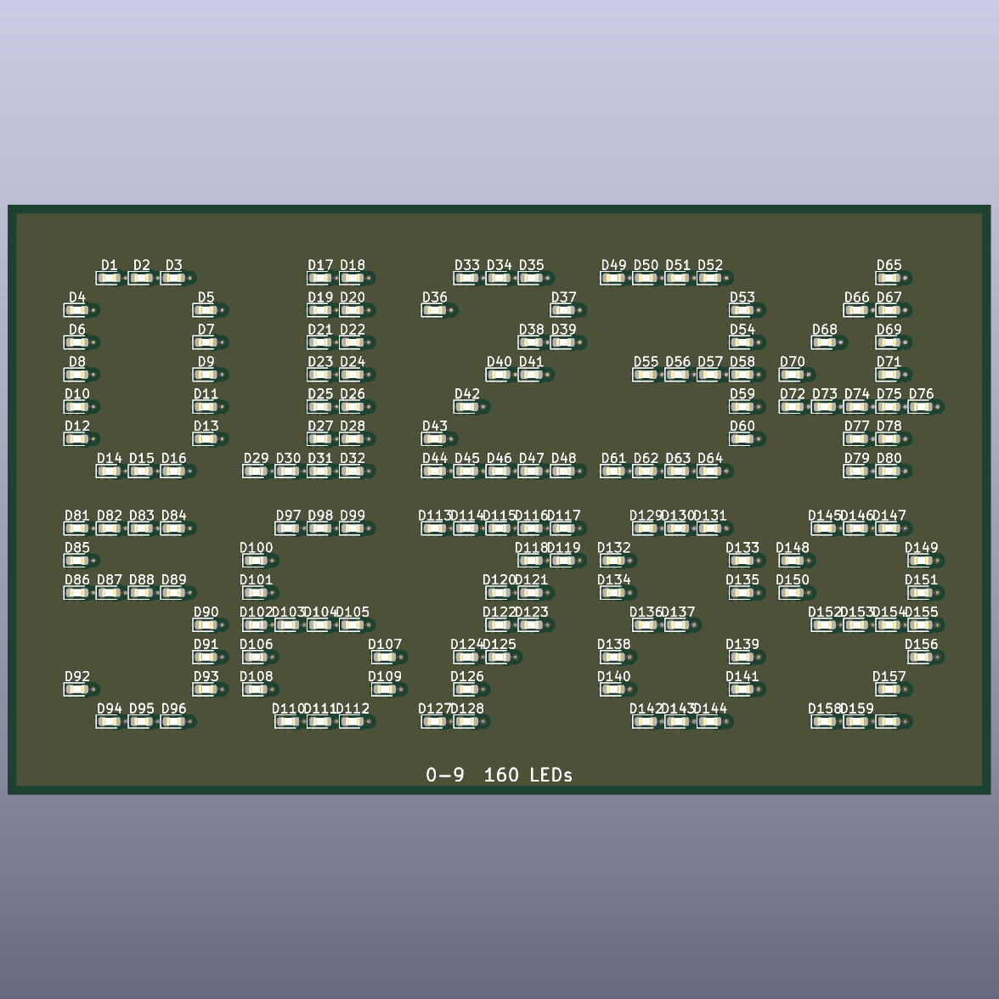

# kicad-flow

An MCP server for authoring **KiCad 10** schematics and boards, built on
[FastMCP](https://github.com/jlowin/fastmcp).

58 primitive calls — place a part, ask where its pins are, draw a wire, name a
net. Nothing above them. The caller decides what the sheet should look like;
this layer says where things actually are.

## Examples

Two designs in [`examples/`](examples/), both built through MCP calls and
nothing else.

| | |
| --- | --- |
| **fc** — an STM32F405 flight controller. Five sheets, 76 nets, crossing pages by global label. <br><br>[](examples/fc/) | **led_digits** — 0-9 in LEDs. 320 parts, 160 vias, 0 unrouted, 0 DRC errors. <br><br>[](examples/led_digits/) |

```bash
python examples/scripts/fc.py
python examples/scripts/led_digits.py
```

## Requirements

- Python >= 3.10
- KiCad 10 — `kicad-cli` on PATH or at its default install location

## Setup

```bash
python -m venv .venv
.venv/Scripts/python -m pip install -e .
```

## Run

```bash
python -m kicad_flow.server            # stdio
python -m kicad_flow.server --http     # http://127.0.0.1:8471/mcp
```

A live monitor comes up with it on `http://localhost:8472`: the active design
rendered, beside the stream of tool calls. `KICAD_FLOW_MONITOR=0` disables it.

## Use with Claude Desktop

In `%APPDATA%\Claude\claude_desktop_config.json`:

```json
{
  "mcpServers": {
    "kicad-flow": {
      "command": "C:\path\to\kicad-flow\.venv\Scripts\python.exe",
      "args": ["-m", "kicad_flow.server"]
    }
  }
}
```

Point `command` at the virtualenv's `python.exe`. Restart Claude Desktop fully.

## Development

```bash
.venv/Scripts/python -m ruff check .
.venv/Scripts/python -m mypy
```

No unit suite — the examples are the check. Run both before a change lands.
