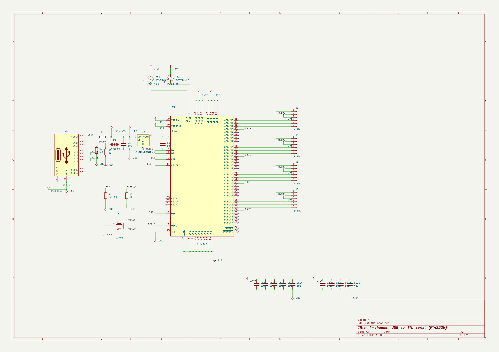

# kicad-flow

An MCP server for authoring **KiCad 10** schematics and boards, built on
[FastMCP](https://github.com/jlowin/fastmcp).

58 tools — 28 schematic, 30 board. All of them primitives: place a part, ask
where its pins are, draw a wire, name a net. There is nothing above them. No
autoplacer, no router, no floorplanner. Each existed and was removed, because
each decided something a caller had no way to override.

What the layer does provide is **arithmetic**. `place_footprint` returns its
pads at their positions *on the board*, rotation and side already applied, so a
caller never repeats that calculation. Getting it wrong is silent: a track drawn
to where a pad would have been unrotated looks connected and is not.

> This layer knows where things are. The caller decides where they should be.

Files are written as KiCad's native S-expressions directly — no third-party
format library — and checked with `kicad-cli`.

## Examples

Nine designs in [`examples/`](examples/), **every one built through MCP calls
and nothing else**. The schematics all report 0 ERC errors.

| example | what it shows | size |
| --- | --- | --- |
| [`mcp_sheet`](examples/mcp_sheet/) | the smallest one: a 5 V → 3.3 V regulator | 1 sheet, 5 nets |
| [`usbc_3v3`](examples/usbc_3v3/) | USB-C in, both CC pulldowns, polyfuse then TVS | 1 sheet, 14 nets |
| [`dual_buffer`](examples/dual_buffer/) | an LM358 — a **multi-unit** symbol, units sharing one reference | 1 sheet, 10 nets |
| [`usb_ttl4`](examples/usb_ttl4/) | an FT4232H four-channel USB-to-TTL adapter, 64 pins | 1 sheet, 55 nets |
| [`multisheet`](examples/multisheet/) | a hierarchy: signals cross by **port**, power by **name** | 4 sheets, 8 nets |
| [`fc`](examples/fc/) | an STM32F405 flight controller, crossing sheets by **global label** | 5 sheets, 76 nets |
| [`usb_ttl1_pcb`](examples/usb_ttl1_pcb/) | a board using every board primitive, including the ones a real layout skips | 12 parts |
| [`led_matrix`](examples/led_matrix/) | the same circuit six ways: packing limits, four rotations, both sides | 6 boards |
| [`led_digits`](examples/led_digits/) | 0-9 in LEDs, schematic and board: 320 parts, 160 vias, **0 unrouted, 0 DRC errors** | 11 sheets, 162 nets |

| | |
| --- | --- |
| [**fc**](examples/fc/) — the MCU page of five. An STM32F405 with its crystal, USB-C, SWD header and decoupling. <br><br>[](examples/fc/) | [**usb_ttl4**](examples/usb_ttl4/) — the whole design on one A3 page. <br><br>[](examples/usb_ttl4/) |

Rebuild any of them:

```bash
python examples/scripts/fc_via_mcp.py
```

Each script chooses every coordinate itself and asks the server only for facts.
Where a layout comes out badly, that is the finding — not a reason to reach past
the API.

[`BUGS.md`](BUGS.md) tracks what is known to be wrong, with the measurement that
found each one.

## Requirements

- Python ≥ 3.10
- KiCad 10 — `kicad-cli` on PATH or at its default install location. Needed for
  ERC, DRC, netlists and rendering; not for writing files.

## Setup

```bash
python -m venv .venv
.venv/Scripts/python -m pip install -e .
```

## Run the server

```bash
python -m kicad_flow.server            # stdio: the transport MCP hosts spawn
python -m kicad_flow.server --http     # MCP on http://127.0.0.1:8471/mcp
```

A live monitor comes up with it on `http://localhost:8472`: the active design
rendered, beside the stream of tool calls. `KICAD_FLOW_MONITOR=0` disables it, a
port number moves it. It runs in its own process and tails the activity log, so
it also picks up edits made by hand in KiCad.

## Use with Claude Desktop

Add the server to `%APPDATA%\Claude\claude_desktop_config.json` (or **Settings →
Developer → Edit Config**):

```json
{
  "mcpServers": {
    "kicad-flow": {
      "command": "C:\\path\\to\\kicad-flow\\.venv\\Scripts\\python.exe",
      "args": ["-m", "kicad_flow.server"]
    }
  }
}
```

Point `command` at the **virtualenv's** `python.exe` — the one where you ran
`pip install -e .` — so `-m kicad_flow.server` resolves without `cwd` or
`PYTHONPATH`. Backslashes are doubled in JSON. Restart Claude Desktop fully; it
stays in the system tray. Logs are in `%APPDATA%\Claude\logs\mcp*.log`.

The config accepts **stdio** only, so a `{"type": "http", "url": ...}` entry
does not work. To run the server yourself and watch its log, bridge the HTTP
port with [`mcp-remote`](https://github.com/geelen/mcp-remote):

```json
"args": ["-y", "mcp-remote", "http://127.0.0.1:8471/mcp", "--transport", "http-only"]
```

## Development

```bash
.venv/Scripts/python -m pip install -e ".[dev]"
.venv/Scripts/python -m ruff check .
.venv/Scripts/python -m mypy
```

**There is no unit suite: the examples are the check.** Each builds a real
design through the server and reports its own result, so a regression shows up
as a design that stops passing. Run all nine before a change lands.

Git hooks enforce that gate: `git config core.hooksPath .githooks` once per
clone. `pre-commit` runs ruff and mypy against the **working tree**, not just
what is staged, so an unrelated unstaged edit can fail it.
