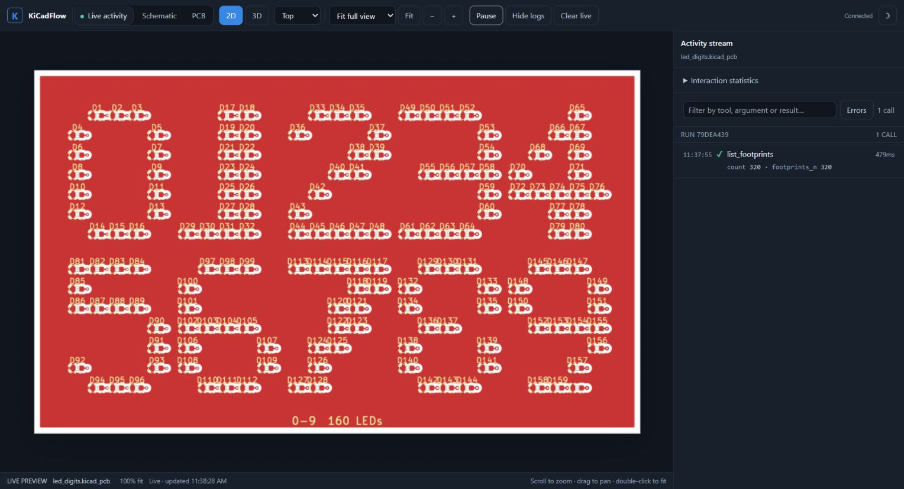

# KiCadFlow

Build KiCad schematics and PCBs through MCP. Small, composable tools handle
file formats and geometry; the caller controls placement, wiring, and routing.

<p align="center">
  <a href="https://github.com/Swamy-BV/kicad-flow/actions/workflows/ci.yml"></a>
  <a href="https://github.com/Swamy-BV/kicad-flow/actions/workflows/codeql.yml"></a>
  <a href="https://github.com/Swamy-BV/kicad-flow/actions/workflows/scorecard.yml"></a>
  <a href="https://www.python.org/"></a>
  <a href="LICENSE"></a>
</p>

## Quick start

Requires Windows, Python 3.10+, and KiCad 10.

```powershell
python -m venv .venv
.\.venv\Scripts\python.exe -m pip install -e .
.\.venv\Scripts\python.exe -m kicad_flow.server doctor
.\.venv\Scripts\python.exe -m kicad_flow.server
```

For an MCP client, use the virtual environment's Python executable with
arguments `-m kicad_flow.server`. Add `--http` for
`http://127.0.0.1:8471/mcp`, or `--tool-search` for on-demand tool discovery.

## Capabilities

- **Schematics:** components, wiring, labels, hierarchy, footprint assignment, ERC.
- **PCB:** schematic synchronization, placement, copper, outlines, stackups, DRC.
- **Review:** connectivity, geometry, proposed-change checks, 2D and 3D renders.
- **Manufacturing:** JLCPCB profiles, Gerbers, drills, BOM/CPL, checked packages.
- **Routing:** optional FreeRouting export, execution, and import.

Coordinates are in millimetres. Check connectivity, ERC, DRC, and renders before
fabrication. See [JLCPCB setup](src/kicad_flow/providers/jlcpcb/README.md) for the
optional local parts catalogue.

## Examples

<table>
  <tr>
    <td width="50%" align="center">
      <a href="examples/led_digits/"></a><br>
      <strong><a href="examples/led_digits/">LED digits</a></strong><br>
      Schematic, PCB, and routing.
    </td>
    <td width="50%" align="center">
      <a href="examples/batman/"></a><br>
      <strong><a href="examples/batman/">Batman</a></strong><br>
      Shaped LED board.
    </td>
  </tr>
  <tr>
    <td width="50%" align="center">
      <a href="examples/art_board/"></a><br>
      <strong><a href="examples/art_board/">Mooncat art board</a></strong><br>
      PCB artwork on both sides.
    </td>
    <td width="50%" align="center">
      <a href="examples/esc4in1/"></a><br>
      <strong><a href="examples/esc4in1/">4-in-1 ESC</a></strong><br>
      Placement exercise; not ready for fabrication.
    </td>
  </tr>
</table>

The [flight controller](examples/fc/) demonstrates a hierarchical STM32 schematic.
For the default five-item limit, see
[staged board transfer](docs/staged-board-transfer.md) and run
`python examples/scripts/staged_board_transfer.py`.
Run the larger examples with an explicit batch limit:

```powershell
$env:KICAD_FLOW_BATCH_LIMIT = "1000"
python examples/scripts/led_digits.py
```

## Dashboard

Open [localhost:8472](http://localhost:8472) for live preview and tool activity.
Schematic and PCB tabs keep inspection snapshots until you refresh them.



## Development

MCP startup instructions are compact; detailed workflows are loaded on demand
through resources or `get_workflow`. See [context delivery](docs/mcp-context.md).

```powershell
python -m ruff check .
python -m mypy
$env:KICAD_FLOW_BATCH_LIMIT = "1000"
python examples/scripts/fc.py
python examples/scripts/led_digits.py
```

Examples are the integration checks. Contributor guidance is in [AGENTS.md](AGENTS.md).
For a Windows bundle, run `packaging/windows/build.ps1`; distribute the entire
`dist/kicad-flow` directory. KiCad remains required.
