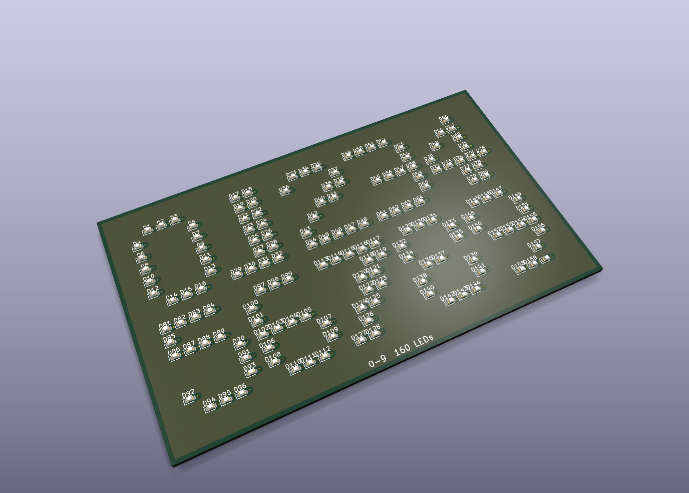

# kicad-flow

An MCP server for authoring **KiCad 10** schematics and boards, built on
[FastMCP](https://github.com/jlowin/fastmcp).

89 primitive calls — place a part, ask where its pins are, draw a wire, name a
net. Nothing above them. The caller decides what the sheet should look like;
this layer says where things actually are.

## Examples

Four designs in [`examples/`](examples/), all built through MCP calls and
nothing else.

| | |
| --- | --- |
| **fc** — an STM32F405 flight controller. Five sheets, 76 nets, crossing pages by global label. <br><br>[](examples/fc/) | **led_digits** — 0-9 in LEDs. 320 parts, 160 vias, 0 unrouted, 0 DRC errors. <br><br>[](examples/led_digits/) |
| **art_board** — connected line/arc outline, circular cutouts and editable front/back silkscreen art. <br><br>[](examples/art_board/) | **batman** — a 16-LED bat signal with matching schematic, shaped PCB, two pours and reverse-side artwork. <br><br>[](examples/batman/) |

```bash
python examples/scripts/fc.py
python examples/scripts/led_digits.py
python examples/scripts/art_board.py
python examples/scripts/batman.py
```

## Requirements

- Python >= 3.10
- KiCad 10 — `kicad-cli` on PATH or at its default install location

## Setup

```bash
python -m venv .venv
.venv/Scripts/python -m pip install -e .
```

## Run

```bash
python -m kicad_flow.server            # stdio
python -m kicad_flow.server --http     # http://127.0.0.1:8471/mcp
```

A live monitor comes up with it on `http://localhost:8472`: the active design
rendered, beside the stream of tool calls. `KICAD_FLOW_MONITOR=0` disables it.
Boards render through KiCad's native 3D engine; `render_board` exposes camera
rotation, perspective, floor, quality, background, zoom, pan and pivot.
`add_graphics` draws typed line, arc, circle, rectangle and polygon primitives
on `Edge.Cuts`, `F.SilkS` and `B.SilkS`; every shape is returned with a UUID so
it can be listed, moved or removed without touching the board file.
Physical stackups, project netclasses and assignments, and numeric custom DRC
constraints are also readable and writable through paired set/list tools.
Board-wide manufacturing limits use the provider-neutral `set_board_limits` /
`get_board_limits` pair. A project can select a dated JLCPCB rigid-FR4 profile
with `set_fabrication_profile`; it supports 2, 4, 6 and 8 layers, applies those
neutral limits without changing geometry, and makes `check_board` enforce the
provider's board-size envelope.
For JLCPCB assembly, `search_parts` queries a local, Git-ignored SQLite
catalogue through a provider-neutral contract. Downloaded SnapEDA/SnapMagic or
Component Search Engine KiCad bundles can be installed through
`import_project_library`; symbols, footprints, models, provenance, and KiCad
library tables remain inside that project rather than changing global KiCad
configuration. See [`providers/jlcpcb/README.md`](src/kicad_flow/providers/jlcpcb/README.md).

## Use with Claude Desktop

In `%APPDATA%\Claude\claude_desktop_config.json`:

```json
{
  "mcpServers": {
    "kicad-flow": {
      "command": "C:\path\to\kicad-flow\.venv\Scripts\python.exe",
      "args": ["-m", "kicad_flow.server"]
    }
  }
}
```

Point `command` at the virtualenv's `python.exe`. Restart Claude Desktop fully.

## Development

```bash
.venv/Scripts/python -m ruff check .
.venv/Scripts/python -m mypy
```

No unit suite — the examples are the check. Run both before a change lands.
