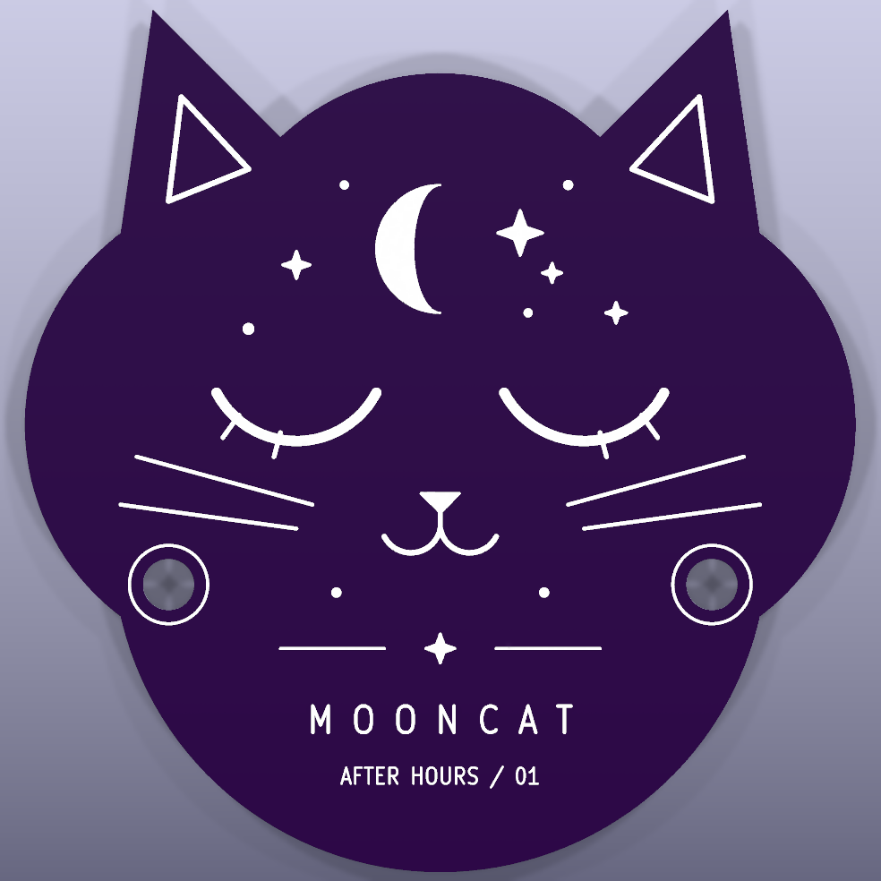

# Mooncat

A two-sided celestial PCB charm: a sleepy cat and crescent on the front, an
orbital fish emblem and constellation on the reverse. Purple solder mask and
white silkscreen are recorded in the physical stackup.


| Front | Reverse |
| --- | --- |
|  |  |

The board is 52 x 54 mm, 1.6 mm thick, with two 3.2 mm circular cutouts.
This is a decorative geometry example, with no electrical circuit, footprints
or routed copper. The artwork is original and defined entirely by caller-chosen
coordinates. Its 55 graphics exercise lines, three-point arcs, circles,
rectangles, filled/stroked polygons and stable-ID move/delete operations.
Reverse-side text is mirrored for reading from the back.

Run from the repository root:

```powershell
python examples/scripts/art_board.py
```

The script uses only `Client(mcp)` for CAD operations. It recreates the board,
applies the JLCPCB purple-mask profile, runs DRC, and renders front, back and
perspective views. The final inspected build reports **0 DRC errors, 0 warnings,
and 0 MCP failures**. Generated native design files remain local, as with the
other example builds; the script and preview images are versioned.

Artwork edits change this example's explicit input coordinates. No API placement,
routing or artistic decisions are inferred. The two cutouts and outer contour
remain the original example's mechanical geometry.
